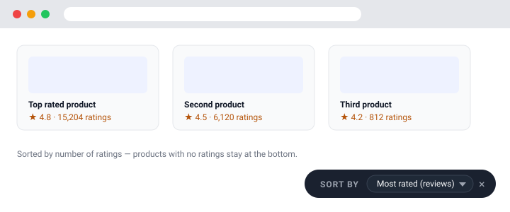

# Sort by Rating — Amazon & Flipkart

A small browser extension that re-orders the products on an Amazon or Flipkart
results page so you can see the **most rated** or **highest rated** items first,
instead of whatever order the site decided on.

Most shopping sites only sort by relevance, price or "featured". Review count —
arguably the strongest signal that a product is actually good — is not a sort
option. This extension adds it.



## Features

- **Most rated** — sort by the number of ratings/reviews (the headline feature).
- **Highest / lowest rating** — sort by the star rating.
- **Fewest reviews** — the other end of the "most rated" sort.
- **Default order** — restore the site's original ordering at any time.
- Products with no ratings yet are always pushed to the bottom.
- Works on the **current page** with no network requests and no data collection.
- Live re-sorting: when lazy-loaded or infinite-scroll products appear, they are
  slotted into the right place automatically.
- A small on-page quick-sort bar, plus a toolbar popup for settings.

## Where it works

| Site | Pages |
| --- | --- |
| Amazon | Search results, category pages, best-seller lists |
| Flipkart | Search results, category pages |

Amazon storefronts supported: `.com`, `.in`, `.co.uk`, `.de`, `.fr`, `.it`,
`.es`, `.ca`, `.com.au`, `.com.br`, `.com.mx`, `.co.jp`, `.nl`, `.se`, `.pl`,
`.sg`, `.ae`, `.sa`, `.com.tr`, `.eg`, `.com.be`.

## Install

### Chrome, Edge, Brave, Opera, Vivaldi (any Chromium browser)

1. Download `sort-by-rating-chromium-v1.0.0.zip` from the
   [latest release](../../releases/latest) and unzip it.
2. Open `chrome://extensions` (or `edge://extensions`, `brave://extensions`, …).
3. Turn on **Developer mode**.
4. Click **Load unpacked** and select the unzipped folder.

### Firefox desktop

1. Download `sort-by-rating-firefox-v1.0.0.zip` from the
   [latest release](../../releases/latest).
2. Open `about:debugging#/runtime/this-firefox`.
3. Click **Load Temporary Add-on…** and pick the zip.

> Temporary add-ons are removed when Firefox restarts. For a permanent install
> the build must be signed by Mozilla (AMO) — see *Publishing* below.

### Firefox for Android

Firefox for Android only installs extensions distributed through
addons.mozilla.org, so use the AMO listing once published, or sign the build
yourself with `web-ext sign`. The Firefox build already opts into Android via
`browser_specific_settings.gecko_android`.

### Other mobile browsers

- **Chrome for Android does not support extensions at all.** No extension can
  change that.
- Chromium-based Android browsers that do support extensions — for example
  **Kiwi Browser**, **Lemur**, **Mises** — accept the Chromium build. Open their
  extensions page and load the unzipped `sort-by-rating-chromium` folder.
- **Firefox for Android** is the best-supported option; see above.

## Usage

Open an Amazon or Flipkart results page and either:

- use the **quick sort bar** in the bottom-right corner, or
- click the toolbar icon and pick a sort order.

In the popup you can also enable:

- **Sort automatically when a page loads** — apply your saved order to every
  results page you open.
- **Show the quick sort bar** — turn the floating bar off if you prefer the
  popup only.

Settings sync across your browsers through the browser's sync storage.

## How it works

There is no background worker and no server. A content script runs on the
supported shopping sites and:

1. Finds the product cards (Amazon: `div[data-component-type="s-search-result"]`;
   Flipkart: `div[data-id^="ITM"]`) and reads the star rating and the ratings /
   reviews count from each one.
2. Groups the cards by their parent element and sorts only within that parent.
   The cards are swapped into each other's original slots, so ads, banners,
   section headings and other non-product siblings stay exactly where they were.
3. Remembers each card's original position, which powers **Default order** and
   stable tie-breaking. A `MutationObserver` re-applies the sort when new
   products load, and skips the DOM write entirely when the order is unchanged,
   so it never loops.

Parsing is deliberately defensive (multiple fallbacks per field) because both
sites change their markup often. If a site redesign breaks a selector, the
product is simply treated as unrated rather than crashing the page.

## Development

```bash
npm install       # dev dependency: jsdom, for tests
npm run icons     # (re)generate src/icons/*.png
npm run build     # build dist/chrome + dist/firefox and release zips
npm test          # run the integration test suite
npm run all       # icons + build + test
```

Project layout:

```
src/
  manifest.json          shared MV3 manifest
  content/content.js     card detection, parsing and sorting
  content/content.css    quick sort bar styling
  popup/                 toolbar popup
tools/
  make-icons.mjs         dependency-free PNG icon generator
  zip.mjs                dependency-free ZIP writer
build.mjs                produces the Chromium and Firefox builds + zips
tests/content.test.mjs   jsdom integration tests of the real content script
```

The tests load the real `content/content.js` into a jsdom document that mimics
Amazon and Flipkart markup, then drive it through the same message API the popup
uses. They cover every sort mode, unrated-product placement, restore-to-default,
and the guarantee that non-product siblings keep their slot.

## Publishing

- **Chrome Web Store / Edge Add-ons**: upload `dist/sort-by-rating-chromium-v*.zip`.
- **addons.mozilla.org**: upload `dist/sort-by-rating-firefox-v*.zip`. The
  manifest declares `data_collection_permissions.required = ["none"]`, as AMO
  now requires for new submissions.

## Privacy

The extension requests only the `storage` permission. It does not make any
network requests, does not read or transmit page content, and collects no data.

## License

[MIT](LICENSE)
